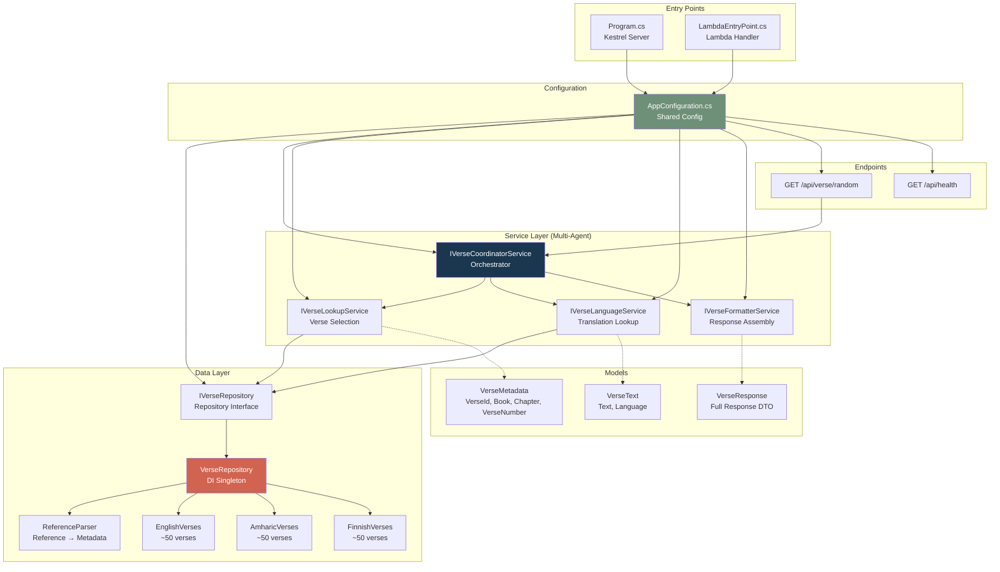
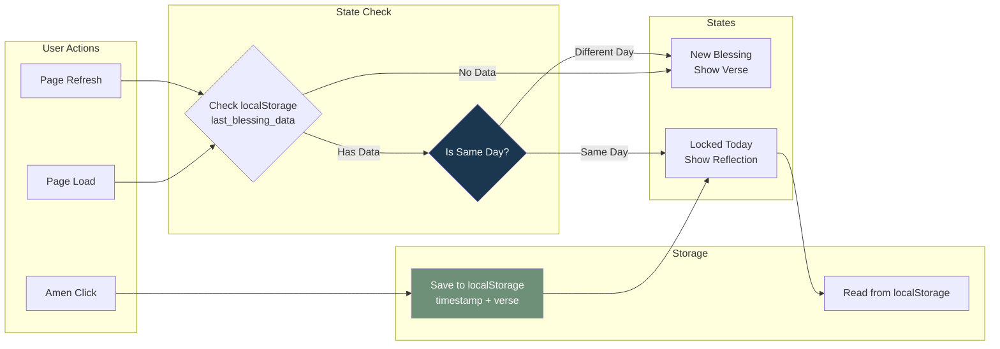
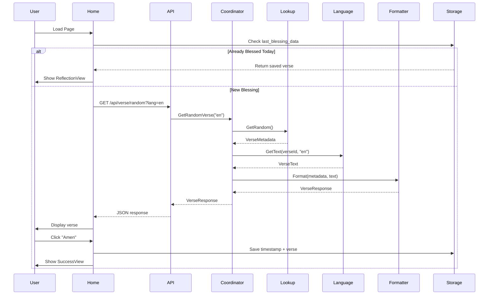

# Component Relationships

## Backend Components



## Frontend Components

```mermaid
graph TB
    subgraph "Entry Point"
        Main[main.tsx<br/>App Bootstrap]
        ErrorBoundary[ErrorBoundary<br/>Error Fallback UI]
    end

    subgraph "Routing"
        Router[React Router v7]
        HomeRoute[/ Route]
        AdminRoute[/admin Route]
    end

    subgraph "Context"
        LanguageContext[LanguageContext<br/>Global Language State]
    end

    subgraph "Pages"
        Home[Home.tsx<br/>Main Verse Display]
        Admin[Admin.tsx<br/>QR Generator]
    end

    subgraph "Components"
        VerseDisplay[VerseDisplay.tsx]
        ReflectionView[ReflectionView.tsx]
        SuccessView[SuccessView.tsx]
        Celebration[Celebration.tsx<br/>Confetti]
        InstallPrompt[InstallPrompt.tsx<br/>i18n-enabled]
    end

    subgraph "Hooks"
        UseLanguage[useLanguage<br/>Language Hook]
        UseDailyBlessing[useDailyBlessing<br/>Blessing State & Lock]
        UseVerse[useVerse<br/>Verse Fetch & Cache]
    end

    subgraph "Services"
        ApiService[api.ts<br/>fetchVerse & ApiError]
    end

    subgraph "Types"
        VerseTypes[verse.ts<br/>Verse, BlessingData]
    end

    subgraph "i18n"
        Translations[translations.ts<br/>Multi-language Strings]
    end

    subgraph "PWA"
        ServiceWorker[Service Worker<br/>Workbox]
        Manifest[PWA Manifest]
    end

    Main --> ErrorBoundary
    ErrorBoundary --> LanguageContext
    Main --> ServiceWorker
    LanguageContext --> Router
    Router --> HomeRoute
    Router --> AdminRoute
    HomeRoute --> Home
    AdminRoute --> Admin
    Home --> VerseDisplay
    Home --> ReflectionView
    Home --> SuccessView
    Home --> Celebration
    Home --> InstallPrompt
    Home --> UseLanguage
    Home --> UseDailyBlessing
    Home --> UseVerse
    UseVerse --> ApiService
    UseVerse --> UseLanguage
    UseDailyBlessing --> VerseTypes
    ApiService --> VerseTypes
    UseLanguage --> LanguageContext
    InstallPrompt --> UseLanguage
    LanguageContext --> Translations
    ServiceWorker --> Manifest

    style LanguageContext fill:#1a374f,color:#fff
    style Home fill:#6f9078,color:#fff
    style ServiceWorker fill:#d06450,color:#fff
    style ErrorBoundary fill:#d06450,color:#fff
```

## Data Flow: Daily Blessing Rule



## Component Interaction: Verse Fetching


