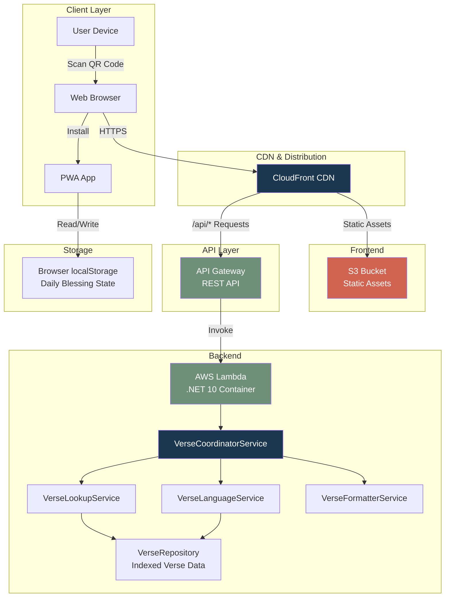

# System Architecture

## Overview

Encourager follows a serverless architecture pattern, leveraging AWS services for scalability and cost-effectiveness. The system is split into three main components: frontend, backend API, and infrastructure. The backend uses a multi-agent service layer pattern where a Coordinator orchestrates Lookup, Language, and Formatter sub-services.

## High-Level Architecture

## Architecture Layers

### 1. Client Layer
- **Web Browser**: Initial access point via QR code or direct URL
- **PWA**: Progressive Web App installed on user's device
- **Offline Support**: Service worker caches assets and API responses

### 2. CDN & Distribution
- **CloudFront**: Global content delivery network
- Routes `/api/*` requests to API Gateway
- Serves static assets from S3
- Handles HTTPS termination and caching

### 3. Frontend Layer
- **S3 Bucket**: Hosts React SPA build artifacts
- **React 19**: Modern UI framework with TypeScript
- **Tailwind CSS 4**: Utility-first styling
- **Vite**: Build tool and dev server

### 4. API Layer
- **API Gateway**: RESTful API endpoint
- Handles CORS configuration
- Routes requests to Lambda function
- Provides request/response transformation

### 5. Backend Layer
- **AWS Lambda**: Serverless compute (container image)
- **.NET 10 Minimal APIs**: Lightweight web framework
- **Multi-Agent Service Layer**:
  - `IVerseCoordinatorService` — orchestrates sub-services
  - `IVerseLookupService` — random or ID-based verse selection
  - `IVerseLanguageService` — language-specific text retrieval with fallback
  - `IVerseFormatterService` — assembles `VerseResponse` from metadata + text
- **IVerseRepository / VerseRepository**: DI-injectable indexed data from verse arrays (no database); validates array lengths at construction
- **ReferenceParser**: Parses Bible references into structured metadata

### 6. Storage Layer
- **Browser localStorage**: Client-side persistence
- Stores daily blessing state (`last_blessing_data`)
- Stores language preference (`lang`)

## Key Design Decisions

1. **Serverless Architecture**: No servers to manage, auto-scaling, pay-per-use
2. **Static Frontend**: S3 + CloudFront for global distribution and caching
3. **Multi-Agent Service Layer**: Coordinator pattern with Lookup, Language, and Formatter sub-services for separation of concerns
4. **In-Memory Backend**: No database needed for static verse data (~50 verses per language)
5. **Client-Side State**: Daily blessing rule enforced in browser, no backend state
6. **Dual Entry Points**: `Program.cs` for local dev, `LambdaEntryPoint.cs` for AWS

## Technology Choices

- **React 19**: Latest React features, compiler optimizations
- **.NET 10**: Modern C# 14 features, minimal APIs
- **AWS SAM**: Infrastructure as Code for CloudFormation
- **Docker**: Containerized Lambda deployment
- **GitHub Actions**: CI/CD automation
